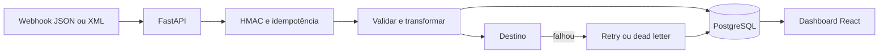

# Aresta

Painel full stack para receber webhooks, transformar payloads e acompanhar falhas de integrações sem perder o contexto da execução.

**[Abrir demonstração](https://relayops.danielzz7918.chatgpt.site)**

> A versão online usa dados de demonstração para continuar acessível sem infraestrutura externa. Ao rodar com Docker, o painel se conecta à API Python e persiste os eventos no PostgreSQL.

## Por que esse projeto existe

Em integrações reais, o problema não termina quando uma API responde com erro. É preciso saber qual payload falhou, evitar processamento duplicado, decidir se vale tentar novamente e deixar informação suficiente para outra pessoa investigar.

O Aresta concentra esse fluxo em um lugar só:

- recebe webhooks JSON ou XML;
- verifica assinatura HMAC e chave de idempotência;
- valida e transforma campos antes da entrega;
- registra status, duração, tentativas e `correlation_id`;
- separa erros recuperáveis de erros definitivos;
- permite retry e envia eventos esgotados para `dead_letter`;
- mostra fluxos, eventos, incidentes, notificações e a saúde dos destinos em um dashboard responsivo;
- permite filtrar execuções, testar conexões, pausar destinos e resolver incidentes pela interface.

## Stack

| Camada | Tecnologias |
| --- | --- |
| Web | React 19, TypeScript, Vinext/Vite, CSS responsivo |
| API | Python 3.12, FastAPI, Pydantic, SQLAlchemy |
| Dados | PostgreSQL em Docker, SQLite como fallback local |
| Qualidade | Vitest/Node Test, unittest/pytest, Ruff, ESLint |
| Entrega | Docker Compose, GitHub Actions, Cloudflare Worker |
| Processos | BPMN 2.0 com definições de jobs para Camunda 8 |

## Arquitetura



O detalhamento do ciclo dos eventos está em [docs/architecture.md](docs/architecture.md). O mesmo processo também foi modelado em [BPMN](bpmn/aresta-webhook-process.bpmn) para facilitar uma futura integração com Camunda 8.

## Rodando o projeto

Pré-requisito: Docker com o plugin Compose.

```bash
docker compose up --build
```

Depois que os serviços ficarem saudáveis:

- painel: `http://localhost:4173`
- API: `http://localhost:8000`
- Swagger: `http://localhost:8000/docs`

O primeiro fluxo, `Checkout → CRM`, é criado automaticamente.

## Testando um webhook

Consulte o ID do fluxo:

```bash
curl http://localhost:8000/api/v1/workflows
```

Use o ID retornado no exemplo abaixo:

```bash
curl -X POST http://localhost:8000/api/v1/workflows/SEU_FLOW_ID/events \
  -H 'Content-Type: application/json' \
  -H 'X-Idempotency-Key: order-1042' \
  -H 'X-Correlation-ID: checkout-1042' \
  -d '{
    "order": {"id": "ord-1042"},
    "customer": {"email": "marina@example.com"},
    "total": 189.90
  }'
```

Se a mesma requisição for enviada de novo com `order-1042`, a API devolve o evento existente e inclui `X-Aresta-Deduplicated: true`.

Para reproduzir um timeout e testar retry, acrescente `"simulate_failure": true` ao payload.

Também há exemplos prontos em [examples/requests.http](examples/requests.http) e [examples/payloads](examples/payloads).

## Testes e qualidade

Frontend:

```bash
npm ci
npm run lint
npm test
```

Motor Python sem dependências externas:

```bash
cd services/api
PYTHONPATH=. python3 -m unittest tests.test_engine tests.test_payloads tests.test_signatures -v
```

Suíte completa da API:

```bash
cd services/api
python -m pip install -e '.[dev]'
ruff check app tests
pytest
```

O pipeline em `.github/workflows/ci.yml` executa as duas suítes em cada push e pull request.

No estado atual, o projeto tem **21 testes automatizados**: 15 na API e 6 na interface.

## Estrutura principal

```text
app/                  dashboard React/TypeScript
services/api/app/     API, banco e motor de integrações
services/api/tests/   testes de payload, retry e assinatura
bpmn/                 processo compatível com Camunda 8
docs/                 arquitetura e decisões técnicas
examples/             payloads JSON/XML e chamadas HTTP
docker-compose.yml    web, API e PostgreSQL
```

## Decisões que eu quis explorar

- **Idempotência antes de processamento:** duplicatas retornam o evento original.
- **Retry seletivo:** payload inválido não melhora com uma nova tentativa; timeout pode melhorar.
- **Demo útil sem esconder a arquitetura:** o site online funciona sozinho, mas o modo Docker conecta todas as camadas.
- **BPMN como evolução, não dependência artificial:** o projeto roda sem Camunda e mantém um modelo pronto para orquestração distribuída.

A decisão sobre idempotência e retry está registrada em [ADR 0001](docs/decisions/0001-idempotency-and-retries.md).

## Próximos passos

- mover retries para uma fila com backoff exponencial;
- criar adaptadores HTTP configuráveis por fluxo;
- adicionar autenticação e isolamento por organização;
- exportar métricas para Prometheus/Grafana;
- executar o processo BPMN em um cluster Camunda 8.

Usei ferramentas de IA como apoio para comparar alternativas e revisar pontos específicos. As decisões, a implementação e os testes foram validados durante o desenvolvimento do projeto.
