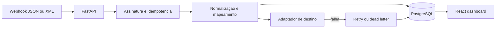
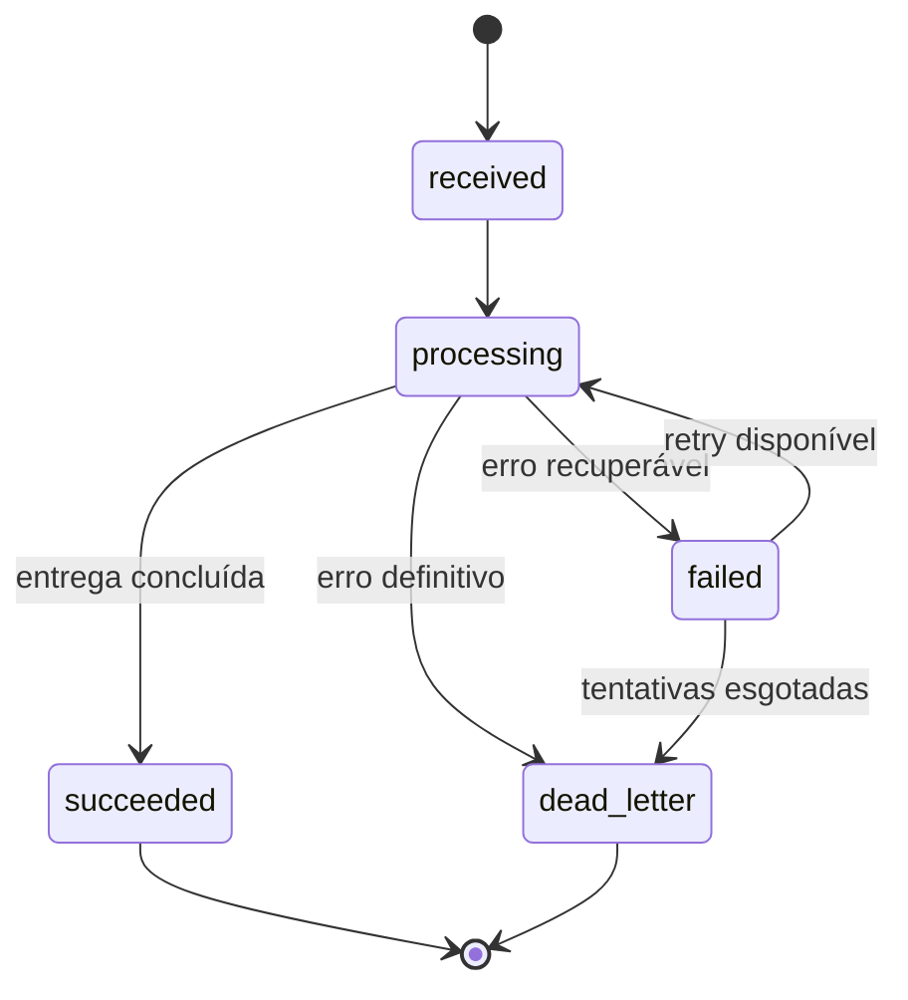

# Arquitetura

O Aresta separa a experiência de monitoramento do processamento dos eventos. O painel continua navegável com dados de demonstração; ao definir `NEXT_PUBLIC_ARESTA_API_URL`, ele envia o webhook simulado para a API real.

## Ciclo de um evento

## Decisões importantes

- A chave de idempotência é única por fluxo. O mesmo webhook não cria duas execuções.
- A assinatura HMAC-SHA256 é opcional por fluxo e verificada antes de interpretar o payload.
- JSON e XML chegam a uma representação canônica antes das regras de validação e transformação.
- Erros de validação não entram em retry. Timeout e indisponibilidade de destino entram.
- Após a tentativa inicial e três retries, o evento vai para `dead_letter`.
- `correlation_id` acompanha o evento para facilitar busca em logs e troubleshooting.

## Caminho para Camunda 8

O arquivo [`bpmn/aresta-webhook-process.bpmn`](../bpmn/aresta-webhook-process.bpmn) representa o mesmo fluxo em BPMN 2.0 e inclui `zeebe:taskDefinition` para Camunda 8. A aplicação não depende do Camunda para rodar: o modelo existe como uma evolução possível para cenários que exigem processos longos, tarefas humanas e orquestração distribuída.
